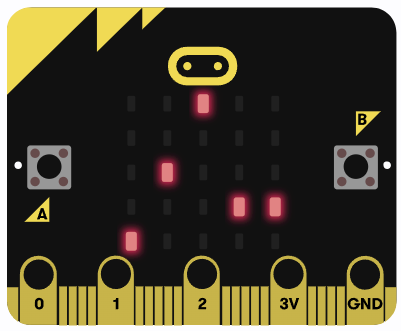

# Binární hodiny s micro:bit a RTC modulem DS1302
Pokusný projekt s micro:bit ukazuje aktuální čas v BCD kódu. To znamená, že jednotlivé číslice čísla v desítkové soustavě jsou ve stejném pořadí vyjádřeny čísly ve dvojkové soustavě. Zde v pořadí: desítky hodin, jednotky hodin, desítky minut a jednotky minut. Mezi jednotkami hodin a desítkami minut je blikající oddělovač nahrazující dvojtečku. Bity s nejnižší hodnotou jsou na řádku 4 maticového displeje, bity s nejvyšší hodnotou na řádku 1, oddělovač na řádku 0.

Na obrázku je zobrazen čas 14:22.

Uchování času i po vypnutí základní desky micro:bit zajišťuje RTC modul DS1302.

RTC modul je k micro:bit připojen takto:

| pin DS1302 | pin micro:bit |
|------------|---------------|
| CLK        | 13            |
| DAT        | 14            |
| RST        | 15            |

K nastavení přesného času v modulu DS1302 je určen projekt "DS1302-set-time" - https://makecode.microbit.org/S05452-41199-06019-32320 . 

## Možná vylepšení

- Nastavení přesného času a jeho zapsání do RTC pomocí tlačítek A a B a dotykového senzoru
- Zobrazení data a dne v týdnu
- Budík využívající buzzer na základní desce micro:bit a nastavení času buzení pomocí tlačítek
- a další ...

## Projekt v Makecode

> Otevřít tuto stránku v aplikaci [https://georger420.github.io/bcd-binary-watch-with-rtc-ds1302/](https://georger420.github.io/bcd-binary-watch-with-rtc-ds1302/)

Do projektu je třeba do importovat rozšíření pro DS1302 - (https://github.com/makecode-extensions/DS1302)

## Upravit tento projekt

Slouží k úpravě tohoto úložiště v aplikaci MakeCode.

* otevřít [https://makecode.microbit.org/](https://makecode.microbit.org/)
* klikněte na možnost **Import** a poté na **Import adresy URL**
* vložte **https://github.com/georger420/bcd-binary-watch-with-rtc-ds1302** a klikněte na možnost import

#### Metadata (slouží k vyhledávání, vykreslování)

* for PXT/microbit

